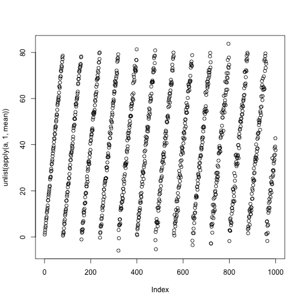

This vignette introduces the `h5array` R/Bioconductor package, which provides `array`- and `matrix`-like objects that store their data in HDF5 files on disk while being useable with the same interface as normal `array` and `matrix` objects.

Installation
------------

Installation from github is easiest using devtools.

```r
install.packages("devtools") # If you do not have it yet
require(devtools)
install_github("PaulPyl/h5array")
```

Basic Usage
-----------


The `h5arrayCreate` and `h5matrixCreate` functions are used to create `h5array` and `h5matrix` objects, these functions are only called once to create the dataset in the HDF5 file on disk.
The following code block illustrates basic usage of the package:

```r
filename = tempfile()
x <- h5matrixCreate(
  filename,
  location = "/NumericMatrix",
  dim = c(1e3, 1e2), storage.mode = "double",
  chunk = c(1, 1e2))
```

```
## Can not create group. Object with name '/' already exists.
```

```r
x[1:23,] <- matrix(rnorm(23*1e2), nrow = 23)
```

We can user the `rhdf5::h5ls` function to inspect the HDF5-file that was created and see which datasets have been created within it:

```r
h5ls(filename)
```

```
##   group          name       otype dclass        dim
## 0     / NumericMatrix H5I_DATASET  FLOAT 1000 x 100
```

The `h5matrixCreate` and `h5arrayCreate` function hand over any additional arguments to the internal `h5createDataset` function from the `rhdf5` package, therefore things like storage mode and chunking can be configured as well. If you are unfamiliar with storage modes and chunking it might help to have a look at the `rhdf5` vignette as well.

Let's create a string array in the same file:

```r
y <- h5arrayCreate(
  filename, #same file
  location = "/CharArray", #New location
  dim = c(3, 4, 5), #since we want 3d data we need to use the h5array class
  storage.mode = "character",
  size = 256 #to store strings in HDF5 files we need to specify the maximum length
  )
y[,,1] <- matrix(sample(letters, size = 3*4), nrow = 3)
```

Investigating the file again we can see the new dataset has been created.

```r
h5ls(filename)
```

```
##   group          name       otype dclass        dim
## 0     /     CharArray H5I_DATASET STRING  3 x 4 x 5
## 1     / NumericMatrix H5I_DATASET  FLOAT 1000 x 100
```

We can also `print` the objects to get a descriptive representation of them:

```r
print(x)
```

```
## HDF5-backed Matrix
## Type: double
## Dimensions: 1000, 100
## File: /var/folders/sh/nzrnpqxj3ndg9fh2qcvzzpfn62qz2p/T//RtmplwXJvD/file319660d4c472
## Head of Data:
##            [,1]       [,2]       [,3]        [,4]        [,5]       [,6]
## [1,] -0.7192092  1.0915587  0.3289505 -0.18231847 -1.34143909 -0.1977551
## [2,] -0.4015518  0.2624153  1.2022207 -0.90884506 -0.27880202 -0.1052586
## [3,] -1.1363456 -0.6027516  0.6354128  0.03463229  0.08158047  1.4951859
## [4,] -0.4090317  0.5040509  0.9099521 -0.46805831 -0.18820698 -0.3749803
## [5,]  1.3524763 -0.3829978 -2.0138337  0.50631464  1.80671440  0.9537483
## [6,]  0.5217534  1.9169934  0.5884776  0.52970636  0.64081414 -0.8772302
```

```r
print(y)
```

```
## HDF5-backed Array
## Type: character
## Dimensions: 3, 4, 5
## File: /var/folders/sh/nzrnpqxj3ndg9fh2qcvzzpfn62qz2p/T//RtmplwXJvD/file319660d4c472
## Head of Data:
## , , 1
## 
##      [,1] [,2] [,3] [,4]
## [1,] "u"  "e"  "m"  "d" 
## [2,] "h"  "y"  "i"  "a" 
## [3,] "z"  "b"  "r"  "q"
```

Adding dimension names is straightforward:

```r
dimnames(y) <- list(
  letters[1:3],
  letters[4:8],
  letters[9:14]
  )
print(y)
```

```
## HDF5-backed Array
## Type: character
## Dimensions: 3, 4, 5
## File: /var/folders/sh/nzrnpqxj3ndg9fh2qcvzzpfn62qz2p/T//RtmplwXJvD/file319660d4c472
## Head of Data:
## , , i
## 
##   d   e   f   g  
## a "u" "e" "m" "d"
## b "h" "y" "i" "a"
## c "z" "b" "r" "q"
```

Dimension names are not stored in the HDF5 file by default but can be written there:

```r
writeDimnamesToFile(y)
h5ls(filename)
```

```
##   group           name       otype dclass        dim
## 0     /      CharArray H5I_DATASET STRING  3 x 4 x 5
## 1     / CharArray.dim1 H5I_DATASET STRING          3
## 2     / CharArray.dim2 H5I_DATASET STRING          5
## 3     / CharArray.dim3 H5I_DATASET STRING          6
## 4     /  NumericMatrix H5I_DATASET  FLOAT 1000 x 100
```

Note how new datasets to store the dimension names have been created.

Once the underlying datasets have been created the actual `h5array` or `h5matrix` objects can be removed (e.g. when closing the R session) and the data can be accessed usign the `h5array` and `h5matrix` functions:


```r
rm(x)
rm(y)
a <- h5matrix(filename, "/NumericMatrix")
b <- h5array(filename, "/CharArray")
print(a)
```

```
## HDF5-backed Matrix
## Type: double
## Dimensions: 1000, 100
## File: /var/folders/sh/nzrnpqxj3ndg9fh2qcvzzpfn62qz2p/T//RtmplwXJvD/file319660d4c472
## Head of Data:
##            [,1]       [,2]       [,3]        [,4]        [,5]       [,6]
## [1,] -0.7192092  1.0915587  0.3289505 -0.18231847 -1.34143909 -0.1977551
## [2,] -0.4015518  0.2624153  1.2022207 -0.90884506 -0.27880202 -0.1052586
## [3,] -1.1363456 -0.6027516  0.6354128  0.03463229  0.08158047  1.4951859
## [4,] -0.4090317  0.5040509  0.9099521 -0.46805831 -0.18820698 -0.3749803
## [5,]  1.3524763 -0.3829978 -2.0138337  0.50631464  1.80671440  0.9537483
## [6,]  0.5217534  1.9169934  0.5884776  0.52970636  0.64081414 -0.8772302
```

```r
print(b)
```

```
## HDF5-backed Array
## Type: character
## Dimensions: 3, 4, 5
## File: /var/folders/sh/nzrnpqxj3ndg9fh2qcvzzpfn62qz2p/T//RtmplwXJvD/file319660d4c472
## Head of Data:
## , , 1
## 
##      [,1] [,2] [,3] [,4]
## [1,] "u"  "e"  "m"  "d" 
## [2,] "h"  "y"  "i"  "a" 
## [3,] "z"  "b"  "r"  "q"
```

We can load the dimnames from the file as well:

```r
b <- loadDimnamesFromFile(b)
print(b)
```

```
## HDF5-backed Array
## Type: character
## Dimensions: 3, 4, 5
## File: /var/folders/sh/nzrnpqxj3ndg9fh2qcvzzpfn62qz2p/T//RtmplwXJvD/file319660d4c472
## Head of Data:
## , , i
## 
##   d   e   f   g  
## a "u" "e" "m" "d"
## b "h" "y" "i" "a"
## c "z" "b" "r" "q"
```

We can apply functions to those objects without having to change code that was written for normal arrays or matrices:

```r
for( i in seq(1, nrow(a))){ #populating the numeric matrix in chunks
  a[i,] <- rnorm(1e3, mean = i %% 80, sd = sqrt(i))
}
print(a)
```

```
## HDF5-backed Matrix
## Type: double
## Dimensions: 1000, 100
## File: /var/folders/sh/nzrnpqxj3ndg9fh2qcvzzpfn62qz2p/T//RtmplwXJvD/file319660d4c472
## Head of Data:
##           [,1]       [,2]     [,3]        [,4]     [,5]      [,6]
## [1,] 0.8063491  1.5919348 1.548363 -0.09426219 1.358331 0.7000718
## [2,] 2.5298370 -0.4538526 2.405303  1.02316276 3.604578 3.9282796
## [3,] 5.0266182  4.5732650 2.223687  6.29159209 4.699591 4.1775776
## [4,] 6.2497248  3.3823500 4.557919  3.28275593 2.451683 3.1186645
## [5,] 3.5203754  8.1771015 2.819270  2.75920712 5.709695 5.6585070
## [6,] 4.6848418  4.6145307 7.981120  9.83783053 7.809542 8.6998028
```

```r
plot(unlist( apply(a, 1, mean) ))
```

 


```r
c <- h5arrayCreate(
  filename, #same file
  location = "/IntArray", #New location
  dim = c(3, 4, 5), #since we want 3d data we need to use the h5array class
  storage.mode = "integer"
  )
c[1,,] <- matrix(rpois(4*5, 23), nrow = 4)
c[2,,] <- matrix(rpois(4*5, 42), nrow = 4)
c[3,,] <- matrix(rpois(4*5, 87), nrow = 4)
```
